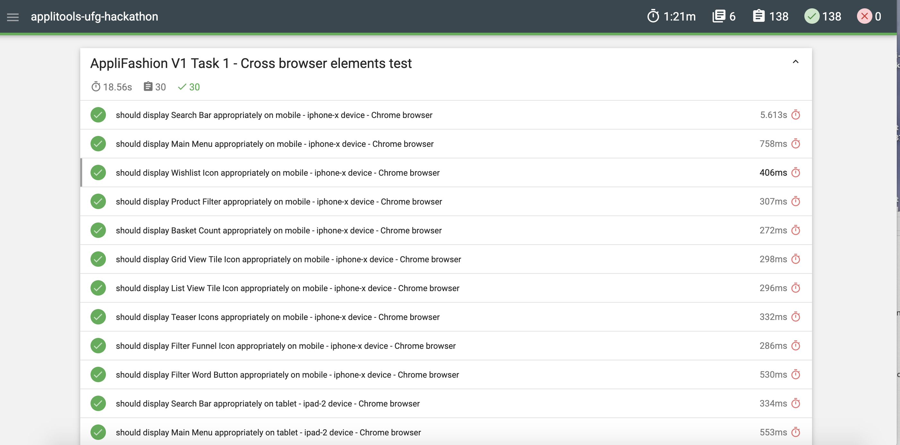

# Applitools Ultrafast Grid Hackathon (Marie Drake)

My submission on the Applitools Ultrafast Grid Hackathon.

## Technology used

- Cypress for writing the traditional tests
- Mochawesome for the test reports for the traditional tests
- Applitools for the modern tests

## Bugs found on Traditional Tests V2

| Bug ID | Description                                                                  | Expected Result                                                                                                            | Actual Result                                                                               |
| ------ | :--------------------------------------------------------------------------- | :------------------------------------------------------------------------------------------------------------------------- | :------------------------------------------------------------------------------------------ |
| 1      | Search Filter not working correctly on V2                                    | When user filters to view black shoes, there should only be 2 images displayed.                                            | 3 images are displayed where one of the shoe's colour is incorrect.                         |
| 2      | Shoe size is displayed incorrectly on V2                                     | Shoe size should say Small as default                                                                                      | Shoe size is displayed as Not Small by default                                              |
| 3      | Filter text and funnel icon should not be displayed on V2 on desktop         | Since the filter feature is already visible by default on desktop, the filter text and funnel icon should not be displayed | Filter text and funnel icon is displayed on V2 on desktop and when clicked, nothing happens |
| 4      | Image teaser icons such as add to favourites or add to cart is missing on V2 | There should be 3 icons per teaser (favourites icon, compare icon and add to basket icon)                                  | No teaser icons displayed                                                                   |

## Notes on test maintenance for Traditional Tests V2

There were some selectors that changed from V1 to V2 so these had to be maintained for some of the tests to pass. Some of the selectors that weren't displayed on some of the viewports on V1 were also now displayed on V2 (I am assuming that these were done on purpose as feature changes).

Even though I did some changes on the existing tests, I felt that I didn't caught all of the visual changes completely and didn't really want to spend more time on it as I intended. It's also difficult to verify CSS changes just by using Cypress on its own.

## Reporting Choice

Because Cypress considers wrapping the commands within a try and catch block a bad practice (more information [here](https://docs.cypress.io/guides/core-concepts/conditional-testing.html#Error-Recovery)), I had problems writing the results of my tests into a text file.

Using the below code snippet triggers an error and so if any of the test fails, the test execution will stop and the result will not be written on the file.

```js
function shouldBeVisible(task, testName, domId) {
  var displayed = true;
  try {
    cy.get(domId).should('be.visible');
  } catch (e) {
    displayed = false;
  }
  return hackathonReporter(task, testName, domId, isDisplayed);
}
```

Instead, I integrated with mochaawesome to display the results in an html file instead which you can see an example below.


