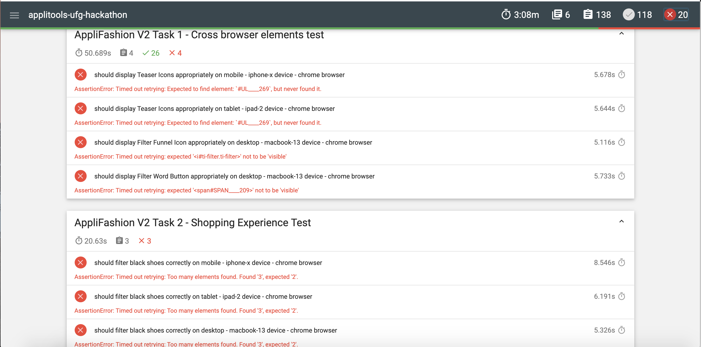

# Applitools Ultrafast Grid Hackathon (Marie Drake)

My submission on the Applitools Ultrafast Grid Hackathon.

## Dependencies

- Node (12.16.1) and NPM (6.13.4)
- Chrome 83
- Firefox 76

## Technology used

- Cypress (4.7.0) for writing the traditional tests
- Mochawesome (6.1.1) for generating the test reports for the traditional tests
- Applitools Eyes for Cypress (3.11.1) for writing the modern tests

## Getting started

To get started, please do the following:

1. Clone this github repo locally

2. `cd applitools-ufg-hackathon` if you are not on this directory

3. `npm i` to install the project dependencies

4. `sh scripts/run-traditional-tests-v1.sh` to run the V1 tests

5. `sh scripts/run-traditional-tests-v2.sh` to run the V1 tests

When the above test scripts are run, this will generate a report at the end that you can click from your terminal. These reports are also saved to the `Reports` folder.

If you just want to view the existing reports without running the tests, please navigate to `Reports > TraditionalTestsV1` or `Reports > TraditionalTestsV2` and open the html report in your browser of choice.

6. To Run the Applitools test, please export your `APPLITOOLS_API_KEY` and then simply run `npm run test:modern`.

<b>Note</b>: I slightly modified the project structure for the Modern Tests. Rather than having `ModernTestsV1` and `ModernTestsV2`, I only have one folder called `ModernTests` and use different Cypress config files to run the same tests on different URLs. Since the test maintenance and reporting is done on Applitools Dashboard directly, there is no benefit creating two folders because the contents are similar.

## Known Limitations

Cypress doesn't currently integrate with third party cloud based solutions such as SauceLabs or BrowserStack. So for the cross browser testing, I decided to run the tests on the following:

- Chrome browser (mobile size - iphone-x dimensions)
- Chrome browser (tablet size - ipad-2 dimensions)
- Chrome browser (laptop size - macbook-13 dimensions)
- Firefox browser (mobile size - iphone-x dimensions)
- Firefox browser (tablet size - ipad-2 dimensions)
- Firefox browser (laptop size - macbook-13 dimensions)

## Time spent on writing Traditional Tests (V1 and V2)

In total, I spent around 5.5 hours (on and off because I was getting distracted by the little one) writing the tests for both V1 and V2 with respective breakdown added below. This didn't include exploring the app which I time boxed around 30 mins.

- Installing Cypress: 5 mins
- Writing tests for V1: 2 hours
- Test maintenance for V2 and finding bugs: 1 hour
- Test reporting and project refactoring: 2 hours
- Documentation: 30 mins

## Time spent on writing Modern Tests using Applitools (V1 and V2)

In total, I spent around just over one hour writing the tests for both V1 and V2 when using Applitools. Because there were bugs that I missed on V1, I spent some time marking these bugs in Applitools using the bug region feature.

- Install Applitools Cypress SDK: 2 mins
- Setup project structure with Cypress and Applitools: 10 mins
- Writing tests for V1: 20 mins
- Running tests for V2: 5 mins
- Bug reporting with Applitools: 25 mins
- Documentation: 10 mins

## Bugs found on Traditional Tests V2

| Bug ID | Description                                                                  | Expected Result                                                                                                            | Actual Result                                                                               |
| ------ | :--------------------------------------------------------------------------- | :------------------------------------------------------------------------------------------------------------------------- | :------------------------------------------------------------------------------------------ |
| 1      | Search Filter not working correctly on V2                                    | When user filters to view black shoes, there should only be 2 images displayed.                                            | 3 images are displayed where one of the shoe's colour is incorrect.                         |
| 2      | Shoe size is displayed incorrectly on V2                                     | Shoe size should say Small as default                                                                                      | Shoe size is displayed as Not Small by default                                              |
| 3      | Filter text and funnel icon should not be displayed on V2 on desktop         | Since the filter feature is already visible by default on desktop, the filter text and funnel icon should not be displayed | Filter text and funnel icon is displayed on V2 on desktop and when clicked, nothing happens |
| 4      | Image teaser icons such as add to favourites or add to cart is missing on V2 | There should be 3 icons per teaser (favourites icon, compare icon and add to basket icon)                                  | No teaser icons displayed                                                                   |

## Notes on test maintenance for Traditional Tests V2

There were some selectors that changed from V1 to V2 so these had to be maintained for some of the tests to pass. Some of the selectors that weren't displayed on some of the viewports on V1 were also now displayed on V2 (I am assuming that these were done on purpose as feature changes).

Even though I did some changes on the existing tests, I felt that I didn't caught all of the visual changes completely and didn't really want to spend more time on it as I intended. It's also difficult to verify CSS changes just by using Cypress on its own.

## Reporting Choice

Because Cypress considers wrapping the commands within a try and catch block a bad practice (more information [here](https://docs.cypress.io/guides/core-concepts/conditional-testing.html#Error-Recovery)), I had problems writing the results of my tests into a text file.

Using the below code snippet triggers an error and so if any of the test fails, the test execution will stop and the result will not be written on the file.

```js
function shouldBeVisible(task, testName, domId) {
  var displayed = true;
  try {
    cy.get(domId).should('be.visible');
  } catch (e) {
    displayed = false;
  }
  return hackathonReporter(task, testName, domId, isDisplayed);
}
```

Instead, I integrated with mochawesome to display the results in an html file instead which you can see an example below.


Here is a screenshot below that you can filter only the failed tests with mochawesome report.



## Things I wished to improve

- Use Cypress Docker images and Docker-Compose to run tests in parallel. I deliberately didn't used Docker to try to run tests in parallel because I wanted to show the limitation of doing cross browser testing locally. I could have run a subset of tests only on Firefox but I wanted to make sure that I caught all possible visual bugs I can find. The disadvantage with this approach is that tests are much slower to run (Traditional tests V1 on average took 2mins and on V2 took 3 mins).

- Only have 1 folder for TraditionalTests since most of the contents between `TraditionalTestsV1` and `TraditionalTestsV2` are mostly similar apart from a couple of tests that I updated.
